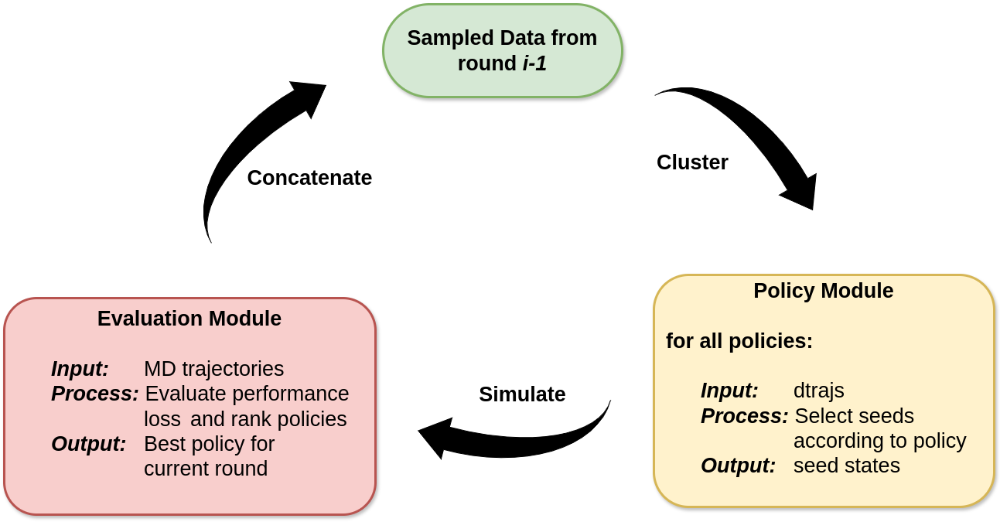

# Optimizing Adaptive Sampling via Policy Ranking

Code for ensemble ranking-based adaptive sampling. This repository contains the **code implementation** for the paper:  
**[Optimizing Adaptive Sampling via Policy Ranking](https://arxiv.org/pdf/2410.15259)**  
*(arXiv:2410.15259v1 [q-bio.BM], October 20, 2024)*  

This work introduces a **modular framework** for adaptive sampling, utilizing **metric-driven ranking** to dynamically identify the most effective sampling policies. By systematically evaluating and ranking an ensemble of policies, this approach enables **policy switching across rounds**, significantly improving convergence speed and sampling performance.

## Highlights:
- **Adaptive Sampling Ensemble:** Dynamically selects the optimal policy based on real-time data.
- **Improved Efficiency:** Outperforms single-policy sampling by exploring conformational space more effectively.
- **Versatility:** Integrates any adaptive sampling policy, making it highly flexible and modular.
- **On-the-Fly Algorithms:** Includes novel algorithms to approximate ranking and decision-making during simulations.


## **Code Description (Policy Ranking)**  
The code implements the **policy ranking** framework described in the paper. Here, we describe the source files, the classes implemented, and major routines for the benefit of the users, in the context of the 2D potentials.  

### **Sampling Scripts**  
- **`single_LC.py`**: Implements the sampling run for the Least Counts policy.  
- **`single_RS.py`**: Implements the sampling run for the Random Sampling policy.  
- **`single_LD.py`**: Implements the sampling run for the Lambda Sampling policy.  
- **`main_betas.py`**: Implements the sampling run for the policy ranking framework.  

### **Core Scripts**  
#### **`Simulation.py`**: Implements the simulation class for the physical system.  
- **Class: `ToySimulation`**  
  - **`get_initial_data()`**: Generates initial simulation (round=0) data for the system.  
  - **`cluster()`**: Performs clustering of the trajectory data.  
  - **`plot_trajs()`**: Plots trajectories for the 2D potential.  

#### **`Policies.py`**: Contains implementations of the adaptive sampling policies.  
- **Class: `LeastCounts`**  
  - **`_center_states()`**: Creates a dictionary of representative states. In simpler words, it defines which states belong to which cluster.  
  - **`_select_states()`**: Implements the algorithm logic; for Least Counts, it chooses the index of the least visited states.  
  - **`get_states()`**: Converts the chosen state indices to states.  
  - **`generate_data()`**: Generates trajectory data for the system.  
- **Class: `RandomPolicy`**  
- **Class: `LambdaSampling`**  

> **Note:** Both `RandomPolicy` and `LambdaSampling` (subclasses) inherit from `LeastCounts` (parent class). Therefore, only **`_select_states()`** needs to be implemented for these classes, along with any necessary helper routines.  

#### **`Analysis.py`**: Implements the analysis class for the system.  
- **Class: `Evaluate`**  
  - **`_measure_exploration()`**: Computes the exploration metric (ratio of visited states to the total number of states).  
  - **`_rel_entropy()`**: Implements relative entropy as in Eq. (3) of the paper.  
  - **`_make_msm()`**: Constructs a Markov state model at each round for comparison with the ground truth model. The number of states is enforced to ensure consistency, and a uniform prior is added.  
  - **`_metrics()`**: Compiles metrics and implements the objective function according to the beta value.  
  - **`rank_policies()`**: Ranks the policies using the previously defined routines.
    
#### **`Utils.py`**: Contains auxillary/helper routines.

## **Quick Start Guide**  
To run the policy ranking framework, **`main_betas.py`** script is used. The main parameters are described as follows, in addition comments are added for brevity.

### **Simulation Parameters**  
- **`ROOT_PATH`**: *(str.)* Path for the root directory. All trajectory and subsequently generated files will be saved in subdirectories.  
- **`REPLICATES`**: *(int.)* Number of short trajectories to be run per round of adaptive sampling.  
- **`STEPS`**: *(int.)* Length of a single trajectory.  
- **`ROUNDS`**: *(range/list)* Number of adaptive sampling rounds per run.  
- **`ROUND_REPS`**: *(int.)* Number of runs (overall replicates).  

#### **Example**  
If you want to run **5 trajectories per round**, with **50 steps per trajectory**, for a total of **200 adaptive sampling rounds**, and repeat this **10 times** for error quantification, set the parameters as follows:  

- **`REPLICATES`**: `5`  
- **`STEPS`**: `50`  
- **`ROUNDS`**: `range(2, 200, 1)`  
- **`ROUND_REPS`**: `10`  

```python
from Simulation import ToySimulation
from Policies import LeastCounts, RandomSampling, LambdaSampling
from Analysis import Evaluate
import numpy as np
import matplotlib.pyplot as plt
import seaborn as sns
from Utils import*
from tqdm import tqdm


# Round 0
 
ROOT_PATH = "sim_output_betas" 
REPLICATES = 5 
STEPS = 50
ROUND_NO = 0
COORDS = generate_coordinates(REPLICATES,seed=12)

sim_0 = ToySimulation(root_path = ROOT_PATH, round_no=ROUND_NO) # simulation object
trajs_0 = sim_0.get_initial_data(md_steps=STEPS,initial_coords=COORDS, num_reps=REPLICATES, seed = 4000) # path to round 0 trajectories
clus_0, dtraj_0 = sim_0.cluster(trajs_0,num_reps=REPLICATES) # path to clustering object, path to clustered trajectories (dtrajs)

# Round 1

## i. Least Counts

lc_1 = LeastCounts(root_path=ROOT_PATH, round_no=1) # Least Counts(LC) object
st_lc_1 = lc_1.get_states(traj_list=trajs_0) # states(seeds) chosen by LC
trajs_1_lc = lc_1.generate_data(md_steps=STEPS,initial_coords=st_lc_1,num_reps=REPLICATES) # path to trajectories produced by LC seeds 

## ii. Random Sampling

rs_1 = RandomSampling(root_path=ROOT_PATH, round_no=1)
st_rs_1 = rs_1.get_states(traj_list=trajs_0)
trajs_1_rs = rs_1.generate_data(md_steps=STEPS, initial_coords=st_rs_1, num_reps=REPLICATES)

## iii. Lambda Sampling
ld_1 = LambdaSampling(root_path=ROOT_PATH, round_no=1)
st_ld_1 = ld_1.get_states(traj_list=trajs_0)
trajs_1_ld = ld_1.generate_data(md_steps=STEPS, initial_coords=st_ld_1, num_reps=REPLICATES)

## iv. Evaluation 

ev = Evaluate(root_path=ROOT_PATH, round_no=1,num_reps=REPLICATES) # evaluation object
r1_list, df = ev.rank_policies(trajs=[trajs_1_lc,trajs_1_rs,trajs_1_ld]) # returns list of paths to trajectories of highest ranked policies from previous rounds, in this case round 0 trajectories, returns dataframe containing metrics for each policy for current round
best_exp1 = (df.loc[ev.best_policy_name][0]) # exploration from highest ranked policy
best_conv1 = (df.loc[ev.best_policy_name][1]) # convergence from highest ranked policy
best_tot1 = (df.loc[ev.best_policy_name][2]) # total loss from highest ranked policy
best_name1 = (ev.best_policy_name) # name of highest ranked polciy

# Sampling


betas = [0.5] # parameter controlling contribution of exploration and covergence to the total loss function
ROUND_REPS = 50 
ROUNDS = range(2, 200,1)  # Adjust the range accordingly

for BETA in betas:
    exp_list = []
    conv_list = []
    tot_list = []
    name_list = []

    for _ in tqdm(range(ROUND_REPS)):
        r_list = r1_list
        best_exp = []
        best_conv = []
        best_tot = []
        best_name = []

        for r_no in tqdm(ROUNDS):
            lc_obj = LeastCounts(root_path=ROOT_PATH, round_no=r_no)
            st_lc = lc_obj.get_states(traj_list=r_list)
            traj_lc = lc_obj.generate_data(md_steps=STEPS, initial_coords=st_lc, num_reps=REPLICATES)

            rs_obj = RandomSampling(root_path=ROOT_PATH, round_no=r_no)
            st_rs = rs_obj.get_states(traj_list=r_list)
            traj_ls = rs_obj.generate_data(md_steps=STEPS, initial_coords=st_rs, num_reps=REPLICATES)

            ld_obj = LambdaSampling(root_path=ROOT_PATH, round_no=r_no)
            st_ld = ld_obj.get_states(traj_list=r_list)
            traj_ld = ld_obj.generate_data(md_steps=STEPS, initial_coords=st_ld, num_reps=REPLICATES)

            ev_obj = Evaluate(root_path=ROOT_PATH, round_no=r_no, num_reps=REPLICATES, prev_best_data=r_list)
            r_list, df = ev_obj.rank_policies(trajs=[traj_lc, traj_ls, traj_ld],beta=BETA)

            best_exp.append(df.loc[ev_obj.best_policy_name][0])
            best_conv.append(df.loc[ev_obj.best_policy_name][1])
            best_tot.append(df.loc[ev_obj.best_policy_name][2])
            best_name.append(ev_obj.best_policy_name)


        exp_list.append(best_exp)
        conv_list.append(best_conv)
        tot_list.append(best_tot)
        name_list.append(best_name)

    pickle.dump(exp_list,open(f'{ROOT_PATH}/analysis/exp2_{BETA}.pkl','wb'))    
    pickle.dump(conv_list,open(f'{ROOT_PATH}/analysis/conv2_{BETA}.pkl','wb'))  
    pickle.dump(tot_list,open(f'{ROOT_PATH}/analysis/tot2_{BETA}.pkl','wb'))  
    pickle.dump(name_list,open(f'{ROOT_PATH}/analysis/name2_{BETA}.pkl','wb'))   
```
To run single policies, for e.g. Least Counts, single policy scripts can be run, i.e. **`single_LC.py`**. The only difference is that single policy scripts only perform simulation and ranking(redundant) of that particular policy.


